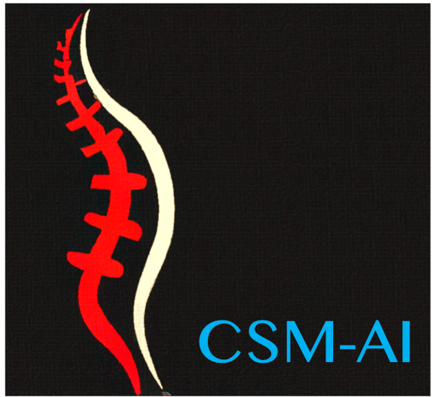

This repository serves as the official source for the CSM-AI dataset, a sustained effort to make a diverse collection of MRI scans of CSM patients publicly available for research purposes. 

### Download 
The latest dataset can be downloaded from the **[Harvard Dataverse repository](https://doi.org/10.7910/DVN/KUUEWC)**. 

### Data format
Each patient has the same naming format, such as  

    images 
    
        | 001
    
            |  sag.nii.gz
            |  axial.nii.gz

Segmentations and radiomics features are stored in 

    derivatives 
    
        | 001
    
            |  sag-seg.nii.gz
            |  axial-seg.nii.gz

### Automated segmentation tool 
We provide a Docker container to segment MR images on your side. 
*segment_one_subject.sh* is the shell script to run the container on one subject. Please make sure:

(a) Your data has the same naming format as the example above. 

(b) The *nvidia-container-toolkit* package is installed corrected. 

